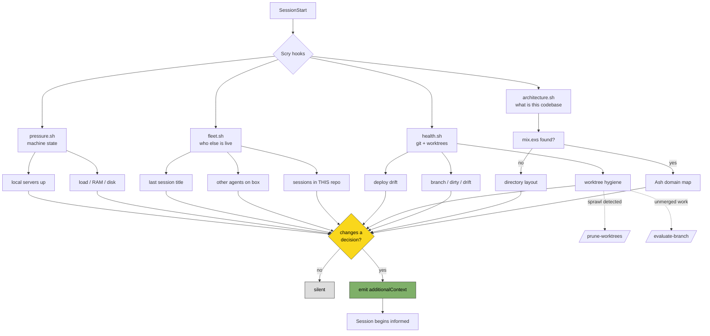

# Session context expansion — design

**Status:** approved and built — see [Decisions](#decisions)
**Date:** 2026-07-26

## What this is

Scry today answers one question at session start: *where am I?* (architecture
via `architecture.sh`, repo hygiene via `health.sh`). Everything else a session
would need to make a good decision, it never learns.

This expands Scry to answer three questions instead of one. Every signal below
was verified as obtainable on 2026-07-26 — nothing here is speculative.

| Question | Today | Proposed |
|---|---|---|
| Where am I? | `architecture.sh`, `health.sh` | unchanged |
| **What else is happening?** | — | `fleet.sh` |
| **What shape is the machine in?** | — | `pressure.sh` |

## Why it matters

Six Claude sessions and a Codex process were live on one machine, five of them
in the same repo, three older than 36 hours. Each believed it was alone. That
is the mechanism behind the branch sprawl already documented in `CLAUDE.md` —
not carelessness, but **structural blindness**: no session can see the others,
so no session can yield to one.

Machine load at the same moment was 19.6 on 8 cores. Every session was
contributing to a slowdown none of them could observe.

## Signal inventory

Verified sources. Cost is wall-clock at session start.

| Signal | Source | Cost | Default |
|---|---|---|---|
| Live sessions in this repo | `~/.claude/projects/` mtimes + `pgrep` | ~50ms | **on** |
| Non-Claude agents (Codex, etc.) | process-name match | ~20ms | **on** |
| Session ages | process `etime` | free | on |
| Last session's title | `aiTitle` in transcript — already written | ~30ms | **on** |
| Load / RAM / disk | `sysctl`, `memory_pressure`, `df` | ~30ms | on, gated |
| Local app running | `lsof -iTCP -sTCP:LISTEN` | ~80ms | on, gated |
| Age of uncommitted work | `git log -1` vs dirty state | free | on, gated |
| Per-session token spend | `usage` blocks in transcript | ~50ms | off |

**Not available locally — do not promise:** plan-level quota ("87% of your
weekly"). It is server-side; nothing on disk carries it. Per-session spend is
computable; percentage-of-plan is not.

**Cut:** calendar. Needs auth and network, and would break Scry's defining
property — sub-second, zero-dependency, always safe to run.

## The core design constraint: the output budget

This is the real risk, and it is not technical.

`health.sh` already emits on every session. Adding four more sources turns
SessionStart into a wall of text that gets skimmed and then ignored — the exact
failure the existing code comments already diagnose about the off-main warning
("correct and identical at every session start for 15 days while the condition
got worse").

**The rule: a signal speaks only when it changes a decision.**

- Load 4 on 8 cores → silent. Load 19 → speak.
- One session in this repo → silent. Four → speak.
- Clean tree → silent. Dirty for 3 days → speak.
- Disk 60% → silent. Disk 94% → speak.

Silence is the default state and the feature. A session that reports nothing is
reporting something: *nothing here needs your attention.*

## Flow

The dotted edges are the existing division of labor, already stated in
`/prune-worktrees`: **hooks detect, skills remediate.** No hook ever deletes,
merges, or judges whether work is worth keeping.

## Correction: subagents are concurrent writers

Found after the first implementation, by cross-checking against
`/prune-worktrees` — which had independently grown an active-worktree guard
based on file mtime.

The guard held `feat/rename-sequence-direction` as "touched in the last 4h — a
concurrent agent may be live in it." `fleet.sh` reported the same worktree as
having no sessions at all. **The guard was right and this design was wrong.**

The evidence: no top-level session had that worktree as its cwd, while 28,682
files in it had been modified within four hours. The writer was a *subagent*
dispatched from a session in the repo root. The original implementation
excluded `subagents/` on the reasoning that a subagent is not an independent
session — true, but the wrong question. A subagent is not a session; it **is** a
concurrent writer, and it does not necessarily work where its parent lives.

Fixed by reading subagent transcripts and attributing them by the cwd they
record for themselves, using every directory touched in the recent window
rather than just the latest — a false warning costs a line, a missed one costs
an edit. Cost: 2ms to `stat` ~1000 transcripts; only those inside the window
are opened.

**The general lesson:** a heuristic that measures the *effect* (files changed)
caught what a precise measurement of the wrong *cause* (sessions) missed. When
two independent checks disagree, the one that looks at outcomes is usually
worth believing first.

## Boundaries

**What a hook must never do:** act. Detect and report only. The remediation
path already exists as skills and stays there.

**Last-session context — where the line falls.** Emitting the *title* plus when
it ran is safe: it is a label, and it reads as a label. Emitting the last
prompt or a content summary is not — stale context reads as current context,
and a session would act on a decision that was reversed in a session it cannot
see. Titles automatic; content on request only.

No LLM call is needed for this. Claude Code already writes `aiTitle` into every
transcript.

## Naming

**Scry is the product name and it stays.** The confusion this resolves was that
"scry" named both the whole tool *and* one script inside it — the Ash domain
scanner — so the word meant two things at once.

| Was | Is | Why |
|---|---|---|
| repo `ash_scry` | `scry` | not Ash-specific anymore; drop the prefix, keep the name |
| `scry.sh` | `architecture.sh` | named for what it reports, so "Scry" only means the product |
| `scry_domains.py` | `scanners/elixir_ash.py` | the language name belongs on the scanner |

The last row is the load-bearing one. The **entry point stays
language-agnostic** and the **scanner carries the language**, because a hook
wired once globally must work in every repo without the installer knowing the
stack in advance. Naming the entry point `elixir.sh` would force a per-repo
choice and defeat the global install entirely. Adding Python means adding
`scanners/python.py` and one detection line — never a second hook.

## Decisions

| # | Decision | Status |
|---|---|---|
| 1 | Global install into `~/.claude/settings.json` | approved |
| 2 | Four separate scripts, not one merged hook | decided (implementation detail) |
| 3 | Renames per the table above | approved |
| 4 | Calendar | **cut** |
| 5 | `health.sh` squash-merge verdict | **deferred** — see below |

**On 2 —** this was raised as a question and shouldn't have been; it's an
implementation detail, not a scope call. Separate scripts, matching the
README's existing "install any or all" ethos: composable, independently
testable, and a failure in one cannot silence the others.

**On 5 —** confirmed as a real defect, deferred by Matt because `health.sh` has
in-flight changes. The worktree sweep decides "already fully merged into
origin/main and safe to remove" using `git merge-base --is-ancestor` alone,
while the *same file* uses a squash-aware patch-id fallback for the primary
worktree 130 lines earlier. Two verdicts, one question.

It fails in the **safe** direction — it can never call an unmerged branch safe,
so no work can be lost to it. What it does instead is report squash-merged
branches as *"UNMERGED but untouched for over 3 days — may hold real work"*,
filling the review queue with false alarms until the queue stops being read.
That is the sprawl engine, not a data-loss risk. Fix is to call the existing
verdict logic from the sweep.
